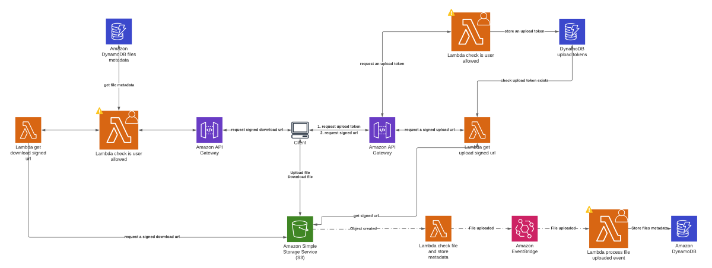

# S4: Serverless Simple Storage Service

**S4** is a serverless stack designed to deploy minimal [AWS](https://aws.amazon.com) resources to safely handle file upload and download for any application.

The three core functionalities of S4 are:

- **Generate S3 presigned upload URL:** Generate S3 presigned POST upload url for any user possessing a token that was previoulsy put in S4 token table.
- **Dispatch file uploaded event:** Dispatch an event alerting that a file was uploaded. The event may then be used to trigger a lambda in your project for instance.
- **Generate S3 signed download URL:** Generate a signed download url so that an authenticated user downloads the file directly from S3.

## Features

- **Deployment ready:** set up your AWS profile and serverless deploy
- **Security:** S3 pre-signed Urls, Lambdas to handle ACLs, the file type is verified directly after upload;
- **Cost efficiency:** Lambdas never process any file content, files are uploaded directly to S3;

## Installation and basic usage

### Deploy

```bash
yarn sls deploy
```

### Create template and deploy

```bash
serverless create --template-url https://github.com/theodo/S4 --path myService
cd myService && serverless deploy
```

## Tutorial: simple example to use S4

Let's use S4 to implement a file upload/download service with a trivial authorization mechanism. Every user that has the string "allowMe" in their name can upload and download any file. It is the "allowMe" example in S4 repository.

### Quickly set up S4 and test "allowMe" example

If you want to test this trivial example with a simplistic frontend app please visit the following repository. It contains a simple React upload component to upload, download and display a list of files as well as a small Readme to set up the project.

https://github.com/trigaut/Serverless-React-Upload-Example

### The requestUploadToken Lambda

This Lambda should check wether the uploader is allowed to upload a file. Then it rejects the request or generates an upload token, stores it in a table and returns it to the uploader.
**What is necessary to implement?** Store an upload token in the DynamoDB tokens table and return it to the uploader.
**What does it do in the example?** The lambda is triggered by an API Gateway Get event with a query string parameter namethat should contain "allowMe" to deliver a uuid v4 token.

[See requestUploadToken code](../examples/allowMe/requestUploadToken/handler.ts)

### The onFileUploaded Lambda

This Lambda is triggered by the `FILE_UPLOADED` EventBridge event and receives the file metadata as payload of the event.
**What is necessary to implement?** You will want to store, in any database, any data needed to retrieve informations about the uploaded file later.
**What does it do in the example?** It stores all the uploaded file metadata into the table shipped with S4.

[See onFileUploaded code](../examples/allowMe/onFileUploaded/handler.ts)

### The getDownloadUrl Lambda

This Lambda checks that the user is allowed to download the file, requested by its file prefix, and invoke another Lambda to generate a signed download URL.
**What is necessary to implement?** Invoke the `getSignedDownloadUrl` Lambda with `{ filePrefix, fileName }` as argument and return the signed download URL.
**What does it do in the example?** The lambda is triggered by an API Gateway Get event with a query string parameter name that should containe "allowMe" to request and return the download url.

[See getDownloadUrl code](../examples/allowMe/getDownloadUrl/handler.ts)

### Test your service

Let's deploy S4, upload and download a pdf

1. Deploy your stack

   ```bash
   yarn sls deploy
   ```

2. Request an upload token

   **Request:**

   ```bash
   curl 'https://{API_GATEWAY_ID}.execute-api.{REGION}.amazonaws.com/api/upload-token?name=allowMe'
   ```

   **Response:**

   ```json
   { "uploadToken": { UPLOAD_TOKEN } }
   ```

3. Request a presigned upload URL
   **Request:**

   ```bash
   curl "https://{API_GATEWAY_ID}.execute-api.{REGION}.amazonaws.com/api/signed-upload-url?uploadToken={UPLOAD_TOKEN}&fileType=application/pdf"
   ```

   **Response:**

   ```json
   {
     "url": { PRESIGNED_UPLOAD_URL },
     "fields": {
       "x-amz-storage-class": { X_AMZ_STORAGE_CLASS },
       "bucket": { BUCKET_NAME },
       "X-Amz-Algorithm": { X_AMZ_ALGORITHM },
       "X-Amz-Credential": { X_AMZ_CREDENTIAL },
       "X-Amz-Date": { X_AMZ_DATE },
       "X-Amz-Security-Token": { X_AMZ_SECURITY_TOKEN },
       "Policy": { POLICY },
       "X-Amz-Signature": { X_AMZ_SIGNATURE }
     }
   }
   ```

4. Upload the file

```bash
   curl --request POST { PRESIGNED_UPLOAD_URL }\
   --form 'key="{ UPLOAD_TOKEN }/${filename}"' \
   --form 'bucket={ BUCKET_NAME }' \
   --form 'x-amz-storage-class={ X_AMZ_STORAGE_CLASS }' \
   --form 'Content-Type="application/pdf"' \
   --form 'X-Amz-Algorithm={ X_AMZ_ALGORITHM }' \
   --form 'X-Amz-Credential={ X_AMZ_CREDENTIAL }' \
   --form 'X-Amz-Date={ X_AMZ_DATE }' \
   --form 'X-Amz-Security-Token={ X_AMZ_SECURITY_TOKEN }' \
   --form 'Policy={ POLICY }' \
   --form 'X-Amz-Signature={ X_AMZ_SIGNATURE }' \
   --form 'file=@{ PATH_TO_FILE }'
```

5. Request a download URL

   **Request:**

   ```bash
   curl "https://{API_GATEWAY_ID}.execute-api.{REGION}.amazonaws.com/api/download-url?fileId={ UPLOAD_TOKEN }&name=allowMe"
   ```

   **Response:**

   ```json
   { "downloadUrl": { DOWNLOAD_URL } }
   ```

6. Download the file

```bash
   curl { DOWNLOAD_URL } --output downloaded_file.pdf
```

### Bonus: the listFiles Lambda

This Lambda queries uploaded files metadata to display a list of files available to download in the following React component example :

[See listFiles code](../examples/allowMe/listFiles/handler.ts)

## Architecture

### Resources

- **A S3 bucket:** a S3 bucket to _store the files_ of end users.
- **A token table:** a Dynamodb table to store _file upload tokens_. These tokens are use to verify that the end user is allowed to upload a file.
- **A getSignedUploadUrl http endpoint:** an endpoint on the route `/api/get-signed-upload-url?uploadToken=UPLOAD_TOKEN&fileType=FILTE_TYPE` that verifies that the upload token is in the token table and returns a presigned POST url to upload a file directly to the S3 bucket.

- **A dispatchFileUploadedEvent handler and an event bridge:** a handler that dispatches a `FILE_UPLOADED` event in an event bridge. This event may be used to trigger any lambda. The payload of the event contains:

```ts
{
    uploadToken: string,
    ressourceId: string,
    ressourceName: string,
    email: string,
    bucketName: string,
    fileName: string,
    fileSize: number,
}
```

- **A getSignedDownloadUrl handler:** this handler may be invoked by an http endpoint of your project to generate a downloadUrl provided the fileName and uploadToken used to upload the file.

```ts
async (filePrefix: string, fileName: string): Promise<{ downloadUrl: string }>
```

### Flowchart

The three Lambda functions with a person icon should be implemented by S4 user.


