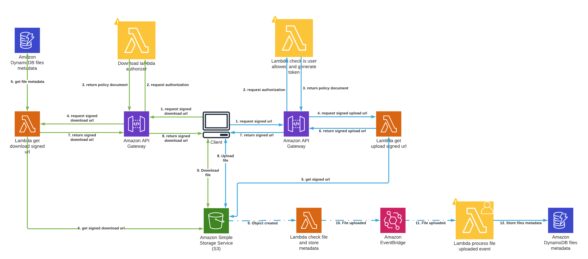

# S4 : Serverless Simple Storage Service

**S4** is a serverless stack designed to deploy [AWS](https://aws.amazon.com) ressources to safely handle file uploading for any application.

## Installation and basic usage

### Deploy

```bash
yarn sls deploy
```

### Create template and deploy

```bash
serverless create --template-url https://github.com/theodo/S4 --path myService
cd myService && serverless deploy
```

## Architecture


